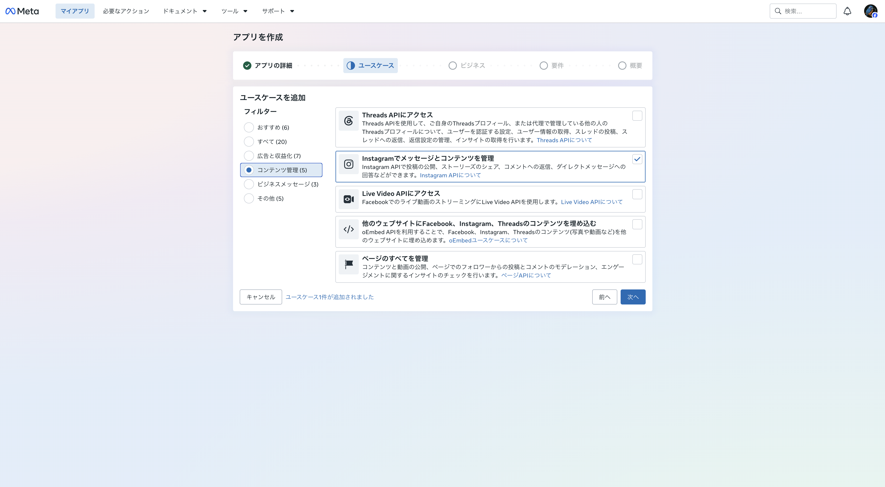
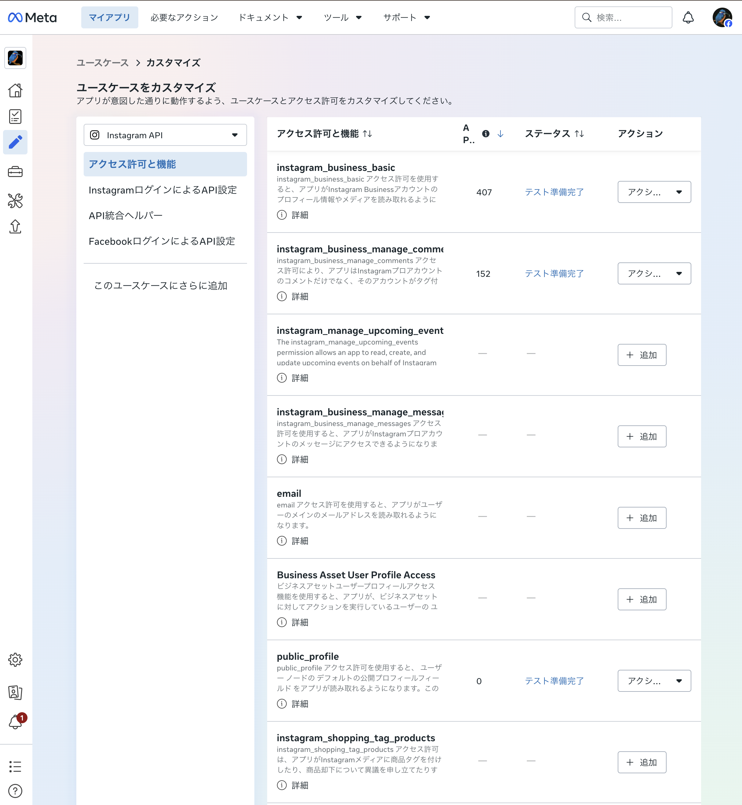

# Meta App Dashboard セットアップ手順 (META_SETUP)

このアプリは「Instagram API with Instagram Login」を使用する。

## 必要なアカウント

| アカウント              | 用途                                                | 備考                                                                |
| ----------------------- | --------------------------------------------------- | ------------------------------------------------------------------- |
| Instagramプロアカウント | APIの操作対象。トークン発行時にログインする         | ビジネス or クリエイター。個人アカウントのままではAPIを利用できない |
| Facebookアカウント      | Meta開発者ダッシュボードへのログイン                | Facebook**ページ**は不要                                            |
| Meta for Developers登録 | 上記Facebookアカウントへの開発者権限付与 (一度きり) | 電話番号 or メールの確認あり                                        |

- プロアカウントへの切り替え: Instagramアプリ → 設定 → アカウントの種類とツール → プロアカウントに切り替える

## 1. Meta for Developersの利用を開始

1. Facebookアカウントの2段階認証・電話認証・メール認証を全て済ませておく (未認証のままだとMeta for Developersの登録時に認証が通らないことがある)
2. [https://developers.facebook.com/apps/creation/](https://developers.facebook.com/apps/creation/) を開いてFacebookアカウントでログイン
3. 画面の指示に従ってMeta for Developersに登録する

### 登録時のSMS認証が届かないとき

- 短時間に再送を繰り返すとレート制限がかかり、エラー表示なしにSMSが送られなくなる。**数時間〜24時間空けて再試行**する
- facebook.com の 設定 → アカウントセンター → 個人の情報 → 連絡先情報 で先に電話番号を認証しておくと通りやすい
- 再試行はシークレットウィンドウで最初からやり直す。電話番号は国コード +81 を選んだ場合、先頭の 0 を抜く

## 2. Metaアプリの作成

1. Meta for Developersの登録が済んだら、「マイアプリ」からアプリを新規作成する
2. ユースケースで **Instagram** 系 (「Instagramでメッセージとコンテンツを管理」等) を選択する  
   
3. 続く「ビジネス」「要件」「概要」は特に変更せず最後まで進めてアプリを作成する (ビジネスポートフォリオは未接続のままで問題ない)

## 3. ユースケースをカスタマイズしてトークンを発行

1. 作成したアプリを開き、左メニュー「ユースケース &gt; ユースケースをカスタマイズ」を開く
2. 「アクセス許可と機能」を開いて以下のアクセス許可を追加し、それ以外は外す (不要な権限を持つと予期せぬセキュリティリスクに繋がるため)  
   
   - `public_profile` (ダッシュボード上で必須として要求される)
   - `instagram_business_basic` (必須。トークンリフレッシュにも必要)
   - `instagram_business_manage_comments` (コメント取得・返信)
3. 「InstagramログインによるAPI設定」を開く
4. 「1. Instagramビジネスログインの設定」で対象のプロアカウントを追加する (Instagramへのログインを求められる)
5. 「2. アクセストークンを生成する」でトークンを生成する。発行されるのは**長期トークン (60日有効)**
6. 生成したトークンをInstagram CRMの「接続状態」欄に貼り付けて接続する

※ 途中でアクセス許可を変更した場合、トークンを再生成しないと反映されない。アプリ側は「トークンを再設定」ボタンから貼り直す  
※ 旧UIでは「Token Generator」という名称で、App Roles → Instagram Testers への追加とInstagram側 (設定 → アプリとウェブサイト → テスター招待) での承認が必要だった。現UIでも承認を求められた場合は同じ場所で承認する

## 4. ドライランモードでAPIをテスト実行

Instagram CRMとの接続はできたのでAPIを呼び出せるようになったが、
Metaアプリが開発モードのままだと**コメントの読み取りが空 (`data: []`) で返る**ため、まだ自動返信は動かない。
公開に切り替えるには「各権限のAPIを実際に呼び出した実績」が必要なので、先にドライランで一通り呼んでおく。

1. Instagram CRMをドライランモード (既定ON) のまま起動し、APIを実行させる (コメントの送信は行われない)
   - 対象アプリのトークンで各権限のAPIを実際に呼び出すと実績が記録される
     (`GET /me`、`GET /me/media`、`GET・POST /{media}/comments`、`POST /{comment}/replies` 等)
2. Meta for Developersに戻り、公開に必要なテスト実行にチェックが入ることを確認する

※ ダッシュボードへの反映は**最大24時間**かかる。反映されるまでは「テスト開始待ち」と表示される

## 5. Meta for Developersアプリを公開

**自分のアカウントだけで使う場合でも公開への切り替えは必須**。
開発モードのままだとコメントの読み取り (`GET /{media-id}/comments`) が空で返る
(2026-07-27 実機確認。テスター登録・承認済みの自分のアカウントのコメントでも同様)。

※ トークン発行やその他のAPIにはテスター登録が引き続き必要

1. 「設定 → ベーシック」で以下を設定する (いずれも必須。未入力だと「Currently ineligible for submission」と表示され公開できない)
   - アプリアイコン: 任意の画像
   - プライバシーポリシーのURL: [https://kenshin-morioka.github.io/instagram-crm/privacy.html](https://kenshin-morioka.github.io/instagram-crm/privacy.html)
   - 利用規約のURL: [https://kenshin-morioka.github.io/instagram-crm/terms.html](https://kenshin-morioka.github.io/instagram-crm/terms.html)
   - カテゴリ: 近いものを選択 (「ビジネスと管理ページ」等)
2. 4 のテスト実行が記録されていることを確認する
3. 左メニューの「公開」を開き、必要な項目を全て満たしていれば公開ボタンが押せるようになるので押下してアプリを公開する

※ ボタンが押せない場合は必須設定が足りていないので、注意モーダル等の表示に従って設定する

## 6. 本番運用前チェックリスト

- [ ] 対象アカウントがプロアカウントである
- [ ] トークンのスコープが先に記載した3つのみである
- [ ] アプリを「公開」に切り替えた (開発モードのままだとコメントが取得できない)
- [ ] ドライラン (既定ON) のまま数周期動かし、`[DRY RUN]` ログで対象判定が意図どおりか確認した
- [ ] 返信文が固定テンプレートとして適切 (スパム的でない) ことを確認した
- [ ] kill switch (UIの「送信を一時停止」) の動作を確認した
- [ ] UIの「実送信を開始する」を押して実送信へ切り替えた
